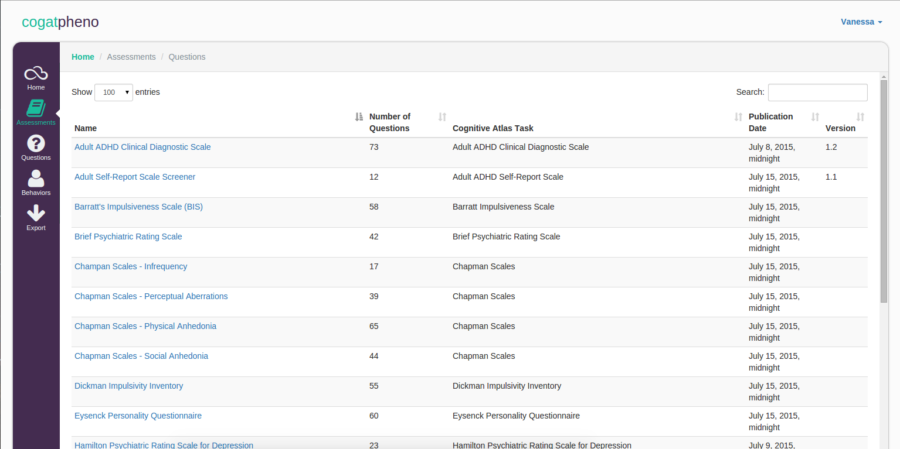

### Cognitive Phenotype

This project aims to tag individual assessment questions (with behavioral terms defined with WordNet) toward the goal of developing an automated ontology of behavior. 

#### Overview

Behavioral assessments capture meaningful information about individual personalities and behavior. While we have structured terms and relationships for cognitive processes (cognitive atlas) and neurologically derived behaviors (neuro behavioral ontology) or specific disorders (autism), if one wants to describe behaviors that capture personality traits, we are lost.

Much work has been done to reduce behavioral assessments to smaller things. Being able to ask fewer questions of an individual and still "get at" the same information saves valuable time and money in the case that someone must be paid to administer such assessment. However, although there may exist high level factors that can describe personality, much detail is lost in these assessments. A related, but different problem, is the sheer number of assessments that exist. We continue to assert that we are being redundant in measuring the same thing, and ask "why can't we just agree on a set of questions or terms?" yet everyone has their metrics of choice, and I'm sure would argue about individual questions, factors, and words to the end of the world. Further, many of these behavioral assessments ask a ton of questions, only to derive one or a handful of final scores that are shown to be non-redundant based on factor analyses. While factor analysis is an important method, it is problematic that data is reduced (typically) based on a smaller set. And although questions may be correlated, that doesn't necessarily mean they are asking about the exact same thing. What we lose in these factor analyses are the subtle details of behavioral traits.

Lots of previous work has attempted to define relationships between terms, usually based on groups of individuals, and while this makes a lot of sense, it of course biases the final outcome to the group and assessments selected. 

What do I want? I want to take a handful of behavioral assessments for some individual, and throw it into a box that will spit out a dimensional, data-driven phenotype. Questions will be automatically tagged with "behavioral traits" and researchers can cluster these traits to reveal groups of similar individuals. I do not want to make any claim about some reduced set of factors, but rather develop a tool that immediately empowers researchers and clinicians to upload any number of behavioral assessments and do this on the fly. My database will be powerful because it will standardize such behavioral assessments, a list of reasonable terms, and if I can prove that it has utility to distinguish (currently defined and limited) disorder categories, it will be valuable.

#### Process

###### Step 1 
Turn assessment questions into terms. I don't care what the question is specifically, but I want to know what it's asking about. If "experts" in the field of psychology have pined over these questions relentlessly, there must be some signal / detail in the words that are used. There exist no good vocabularies, either ontology or trait list, and I don't have patience or time to wait for some group of "experts" to argue over something so subjective. I will come up with an initial list, demonstrate its utility, and then let people create user accounts and hash it out. 

###### Step 2
Assign a direction. I have to know if a high value as a question answers affirms or denies the adjective. This is where the CogPheno interface comes in - once an assessment is added to the database and the direction and terms tagged, it's done. While there are an extreme number of questions and assessments out there, if we had some kind of database with enough people adding to it, we would reach some point of capturing a significant portion of knowledge about personality assessments. I don't understand why no one has done this yet. I'm going to do a lot of hard work to make a giant snowball, and then people will use it because it's the biggest.

###### Step 3
When tagging is done I must demonstrate utility. I will get actual data for a significantly large group of people for the quesetions that are tagged. I will use it to derive a score (with direction applied) for each term. I will do machine learning clustering and then it gets fun - we can ask a lot of questions:

- "How can we relate terms, based on this clustering?"
- "How can we remove data points for individuals, and estimate them? (eg, how can this be used to classify a new case)
- "Do any of these clusterings of terms overlap with (DSM diagnosed) disorders?"

We can then get more creative with regard to the sources of information that we use to define both the labels of the people and the scores. For example, we might find content online produced by some individuals with disorder, parse something written (or twitter, or a blog) or even "expert derived" descriptions of people (eg, web MD, personality manuscripts, etc) and use NLP metrics to come up with the numerical values to do an assessment. The important note is that the tool is ambivalent with regard to the data and clustering ("factors"). I am agnostic to how it is used, or what comes out of it, and will only be doing a use case to argue for its utility.

The base of this work is just a simple list of words, modern, that experts have used to describe people.

#### Tagging Procedure
- Each question must be associated with an adjective (behavioral trait descriptor) or a verb (behavioral statement) in the case that the question cannot be linked to any specific adjective. In the case that the question is describing a symptom (eg, racing thoughts) in which case it would be necessary to say "has racing thoughts," a noun can be used.
- Each time I make a tag to a question, I am making an assertion that a question is measuring the behavioral tag, with the indicated direction
- The direction would theoretically add a descriptor, such as "more" or "less" (or the person could be equivalent to an average)
- Relationships will be defined to describe opposite words (eg, impatient and patient), and these will be mapped to the same dimension based on the direction specified. (eg, impatient positive == patient negative, impatient negative == patient positive)
- Relationships will also be defined to say that some words are measuring the same thing. (eg, interruptive and intrusive)
- If using a verb, the verb should be used in the infinite sense (eg, "sustaining," or "listening")
- dislikes / preferences are also modeled in this manner. It is assumed that asking a question if an individual prefers / likes a behavior is equivalent to measuring a behavioral trait. 
- Descriptors can be added to terms. For example, "craving carbohydrate" is different from "craving fat" and at some point these could be both grouped under "craving food"
- Questions that summarize (final scores, factors, etc) will be removed, as the information is redundant.
